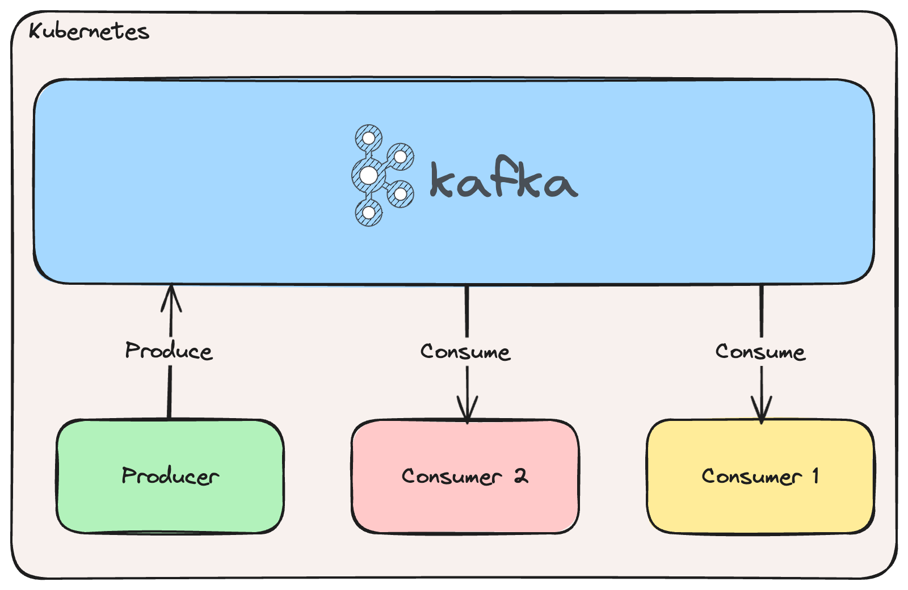

# Kafka on Kubernetes

This example demonstrates how to deploy Kafka on Kubernetes using Helm. Further, the application demonstrates how to
produce and consume messages from a Kafka topic using the kafka-go client library.



## Prerequisites

1. A cluster to deploy to (e.g. [minikube](https://minikube.sigs.k8s.io/docs/start/))
2. [kubectl](https://kubernetes.io/docs/tasks/tools/install-kubectl/)
3. [helm](https://helm.sh/)
4. [tilt](https://tilt.dev/) (Optional: for local development)

## Quickstart

### Deploy locally using Tilt

Deploy using Tilt:

```sh
tilt up
```

Stop using Tilt:

```sh
tilt down
```

### Deploy using kubectl and helm

Deploy with [./scripts/deploy.sh](./scripts/deploy.sh):

```sh
./scripts/deploy.sh
```

Delete with [./scripts/undeploy.sh](./scripts/undeploy.sh):

```sh
./scripts/undeploy.sh
```